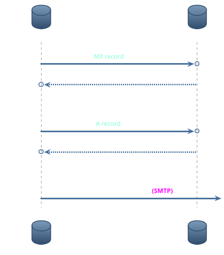

Email use 3 different protocols to send and receive mails : [SMTP](SMTP), [IMAP](IMAP) and [POP3](POP3).

While SMTP is used to handle sending and forwarding part of the process, for the receiving part, there is a choice between IMAP and POP3. 

There is a simplification of the process going on while sending a message :

```plantuml
!theme spacelab

participant SenderClient as "Sender's Email Client"
database SenderMailServer as "Sender's Forwarding Server"
database RecipientMailServer as "Recipient's Receiving Server"
participant RecipientClient as "Recipient's Email Client"

skinparam sequenceMessageAlign center
SenderClient -> SenderMailServer : Send Email <b><color:Fuchsia>(SMTP)</color></b>
SenderMailServer -> RecipientMailServer : Forward Email <b><color:Fuchsia>(SMTP)</color></b>
RecipientMailServer --[#lightgreen]> SenderMailServer : 250 OK Acknowledgment
RecipientClient -> RecipientMailServer : Retrieve Email <b><color:DarkMagenta>(IMAP/POP3)</color></b>
RecipientMailServer --> RecipientClient : Deliver Email <b><color:DarkMagenta>(IMAP/POP3)</color></b>

@enduml
```

But that diagram omit an important part of the process : the [DNS](DNS) request. 
In that part, there is three operations going on :

 - Request for MX record.
 - Request for A record. 
 - Finally forwarding the e-mail. 



Once the sender's mail server obtain the IP address,  it can finally forward the e-mail to the receiver's mail server. 
I will skip that part - will probably go more in detail in [SMTP](SMTP) itself - to jump to the authentication part.
